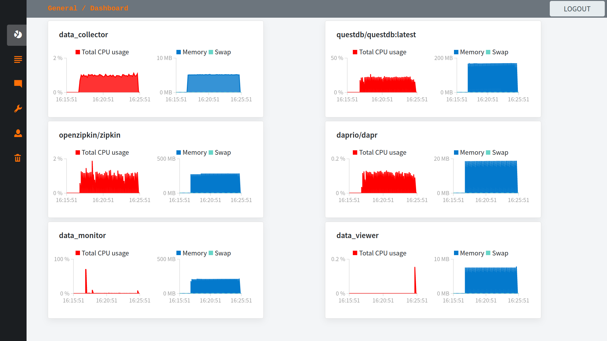
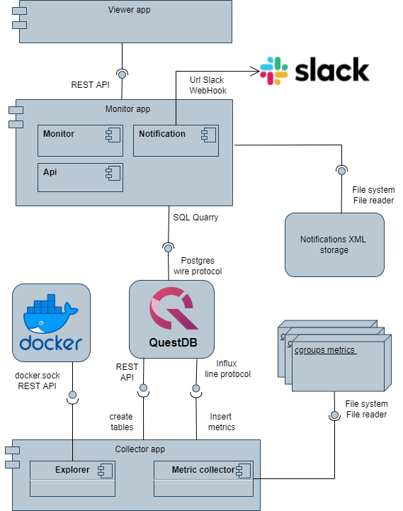

# GAMA monitor

GAMA monitor is an easy-to-deploy, low-resource requirement, open-source monitoring solution focused primarily on monitoring Docker containers. It can monitor and long-time store all basic metrics from CPU, Memory, and IO to Network. One of the features of the GAMA monitor is support for Slack alerting, which can be widely customized.

The monitoring solution contains multiple applications that are deployed as Docker containers. Metrics, as well as major settings, are accessible from a web browser via the REST API. This feature allows remote access to the system.

<div align="center">
  
</div>

## Features

- web UI 
- lightweight footprint, low-resource requirement, easy-to-deploy and maintain 
- monitoring all basic metrics
- alerting to Slack using Webhooku
- multiple type alerts - threshold and change

## Archytecture
<div align="center">
  
</div>


## Tech

GAMA monitor uses a number of technologies  to work properly:

- [Spring boot](https://spring.io/projects/spring-boot) - monitoring, alerting, and REST API 
- C++ - collecting metrics
- [Blazor WebAssembly](https://dotnet.microsoft.com/en-us/apps/aspnet/web-apps/blazor) - front-end
- [cgroups](https://man7.org/linux/man-pages/man7/cgroups.7.html) - CPU, IO, Memory metrics
- [proc](https://man7.org/linux/man-pages/man5/proc.5.html) - PID and Network metrics
- [Docker](https://www.docker.com/) - containerization tool 
- [QuestDB](https://questdb.io/) - Time Series Database for storing metrics


## System requirments
 - read privilege over cgroups pseudo-file system
 - cgroups location /sys/fs/cgroups
 - cgroup v1
 - read privilege over proc  pseudo-file system
 - Docker API verze 1.25 or newest
 - Docker engine 19.03.0+ for 3.9 compose.yml
 - free ports 80 and 8080
 - Docker socket location /var/run/docker.sock
 - Docker Compose 1.29.2

## Installation

Clone or download the git repository:

```bash
git clone --recurse-submodules  git@github.com:GMSkypi/gama_monitor.git 
```

Go to the folder with the monitoring system:
```bash
cd gama_monitor
```

Build and run the monitoring system:
```bash
docker-compose up -d 
```

After a few seconds, the system starts monitoring and the web UI is accessible from the browser for configuring or checking the collected metrics. By default, the web UI is located at address <strong>http://0.0.0.0:80</strong>. The default credentials for login that can be changed are:

 *   username - gama
 *   password - gama 


